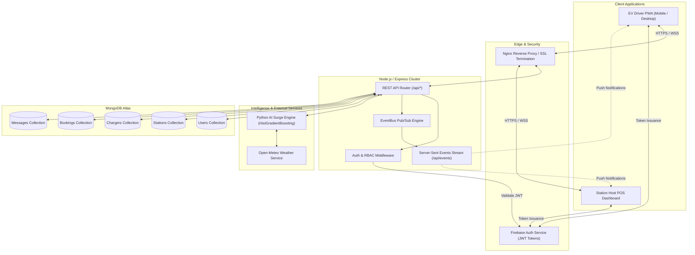
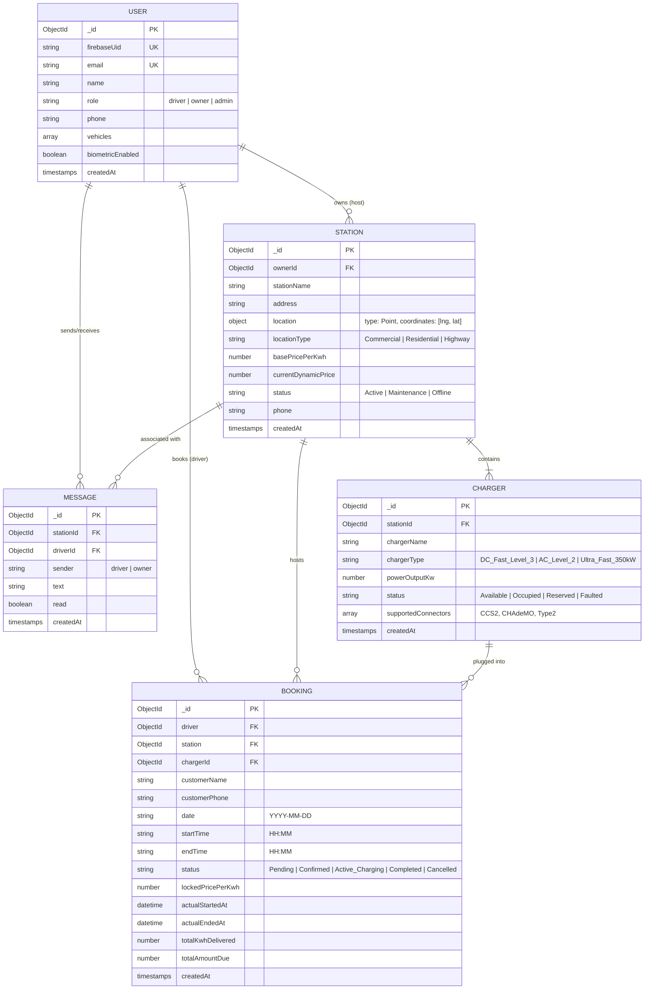
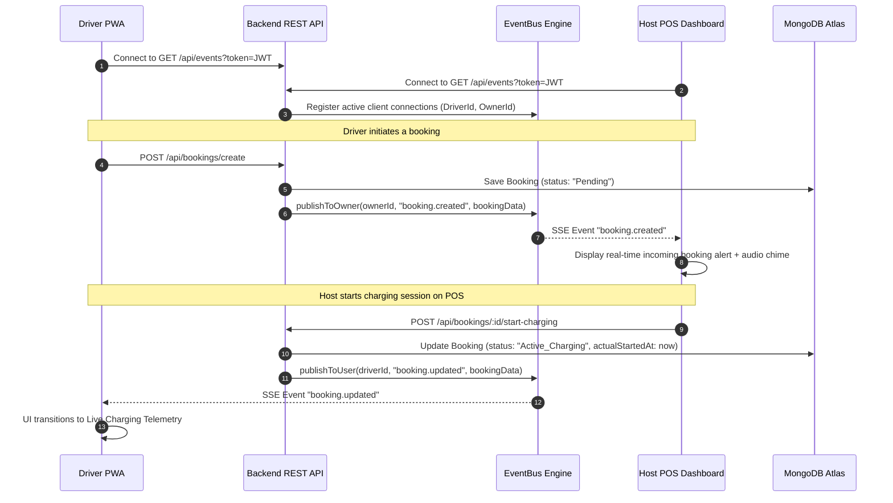
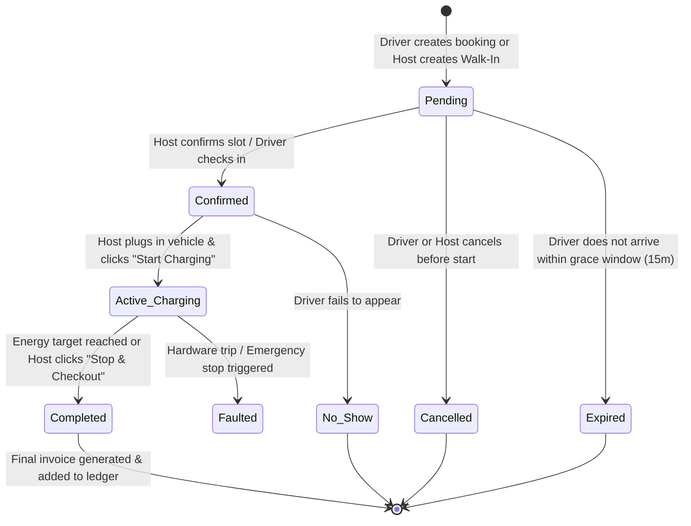

# VoltHive System Architecture & Engineering Design

> [!NOTE]
> This document details the software architecture, entity relationships, real-time event pipelines, state machines, and security models of the VoltHive platform.

---

## 1. High-Level Architectural Topology

---

## 2. Database Entity Relationship Model (ERD)

---

## 3. Real-Time EventBus & Server-Sent Events (SSE)

To deliver instant, low-latency updates without the high battery and computational overhead of bidirectional WebSockets, VoltHive uses a lightweight **Server-Sent Events (SSE)** architecture:

---

## 4. Charging Session Lifecycle & POS State Machine

The platform enforces strict state transitions for every charging session to prevent double-booking and guarantee transparent billing:

### State Descriptions:
1. **Pending**: Slot is reserved; charger is held. Awaiting host confirmation or arrival.
2. **Confirmed**: Reservation is locked in. Charger indicator turns orange ("Reserved").
3. **Active_Charging**: Vehicle is physically plugged in. Energy delivery timer and kWh counters are active.
4. **Completed**: Charging finished; vehicle unplugged. Final ledger transaction recorded with exact duration, kWh consumed, and tariff price.
5. **Cancelled / Expired / No-Show**: Lock released; charger immediately returns to `Available`.

---

## 5. Persistent 1-to-1 Chat Architecture

A core architectural principle of VoltHive is **Single Persistent Thread per Station**:
- A conversation is strictly keyed by `(stationId, driverId)`.
- When a driver clicks "Message" from the Map, Booking Drawer, or Reservations list, the application loads the single historical thread.
- If no prior messages exist, the thread is initialized on first message.
- The Host POS Dashboard groups incoming driver messages by station, showing an aggregated unread count and real-time reply stream.
